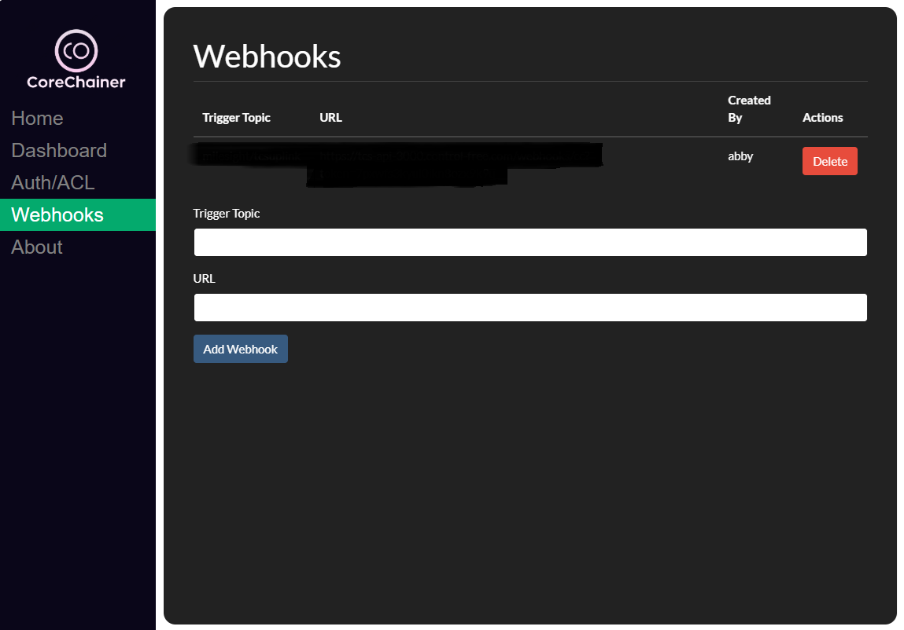

# Queue Mounts

A feature-rich MQTT broker implementation with persistent storage, authentication, and web dashboard.



## Features

- MySQL-based authentication and ACL (Access Control List)
- Persistent message storage using BadgerDB
- WebSocket support for browser-based MQTT clients 
- Admin dashboard for managing users and ACLs
- Real-time statistics and monitoring
- Support for MQTT v3.1.1 and v5.0

## Components

- MQTT Broker (Go)
  - TCP port: 1883
  - WebSocket port: 50040
  - HTTP API port: 18080
- Admin Dashboard (PHP)
  - Web UI port: 10000
  - User/ACL management
  - Real-time stats visualization

## Quick Start

1. Copy the example config and customize:
```bash
cp auth-mysql.example.yml auth-mysql.yml
# Edit MySQL connection details in auth-mysql.yml
```

2. Initialize the MySQL database:
```bash
mysql -u root -p < ddl.sql
```

3. Start services using PM2:
```bash 
pm2 start pm2.config.js
# or
go run main.go --conf=auth-mysql.yml
```

## Configuration

The `auth-mysql.yml` file configures:

- Authentication mode (anonymous/username/client ID)
- ACL mode
- MySQL connection details
- MQTT broker settings

## Architecture

- `main.go` - MQTT broker implementation
- `control-panel/` - PHP admin dashboard
- `hooks/` - MQTT broker plugins for auth, storage etc
- `resources/` - Shared database utilities

## License

MIT License

## Contributing

Pull requests are welcome. For major changes, please open an issue first to discuss what you would like to change.